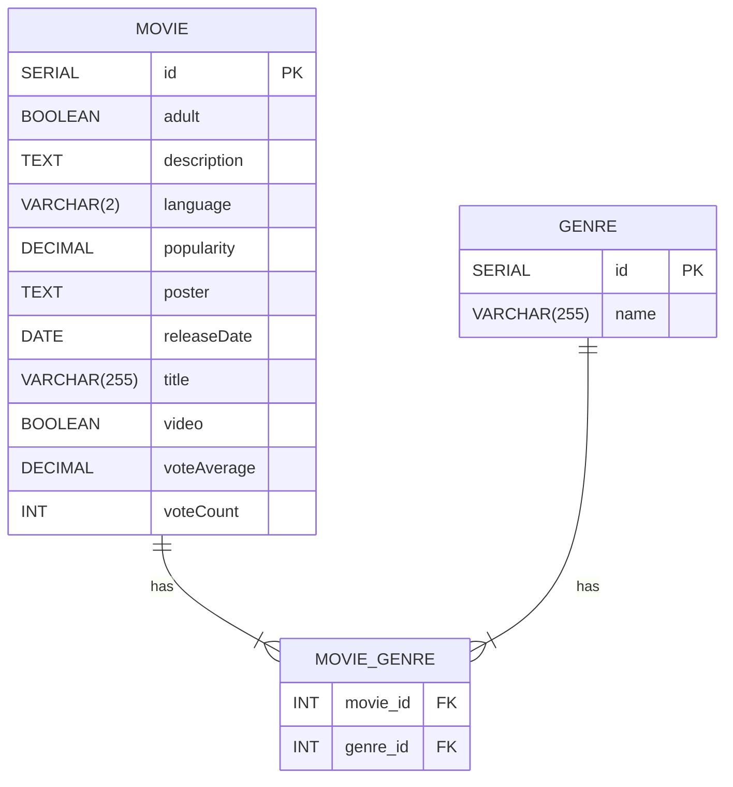

<div align="center">
  
  
  
  <a href="https://github.com/EdnaldoLuiz/movie-analytics/blob/main/LICENSE">
    
  </a>
</div>

## Table of Contents

- [🖥️ Server Configurations](#server-configurations)
- [🌐 Rest API](#rest-api)
- [♟️ Strategy Design Pattern](#strategy-design-pattern)
- [🔗 Relational Model](#relational-model)
- [📚 Key Dependencies](#key-dependencies)
- [🐳 Docker Image](#docker-image)
- [🛠️ Tech Stack Used](#tech-stack-used)

<h2 id="server-configurations">Server Configurations 🖥️</h2>

<table>
  <thead>
    <tr>
      <th>Server</th>
      <th>Description</th>
      <th>Address</th>
    </tr>
  </thead>
  <tbody>
    <tr>
      <td><strong>Local Server</strong></td>
      <td>This is the server you would normally use during development. It runs on your local machine and allows you to test your changes quickly without having to deploy them to a remote server.</td>
      <td><code>http://localhost:8080</code></td>
    </tr>
    <tr>
      <td><strong>Docker Server</strong></td>
      <td>This server is intended for containerized environments and is particularly useful if you are using Docker for development or deployment.</td>
      <td><code>http://localhost:8081</code></td>
    </tr>
    <tr>
      <td><strong>Production Server</strong></td>
      <td>This is the server where your application runs in the production environment. It is configured to handle real traffic and is optimized for performance and reliability.</td>
      <td><code>http://localhost:8082</code></td>
    </tr>
  </tbody>
</table>

<h2 id="rest-api">Rest API 🌐</h2>

### TMDB Controller

<table align=center>
    <thead>
        <tr>
            <th>Endpoint</th>
            <th>Method</th>
            <th>Response</th>
            <th>Description</th>
        </tr>
    </thead>
    <tbody align=center>
        <tr>
            <td>/api/v1/tmdb/fetch</td>
            <td>GET</td>
            <td>Void</td>
            <td>Save movies from the TMDB API to the local database</td>
        </tr>
        <tr>
            <td>/api/v1/tmdb/delete</td>
            <td>DELETE</td>
            <td>Void</td>
            <td>Delete all movies of specific genres</td>
        </tr>
    </tbody>
</table>

### Genres Controller

<table align=center>
    <thead>
        <tr>
            <th>Endpoint</th>
            <th>Method</th>
            <th>Response</th>
            <th>Description</th>
        </tr>
    </thead>
    <tbody align=center>
        <tr>
            <td>/api/v1/genres/count</td>
            <td>GET</td>
            <td>GenreProjection</td>
            <td>Count the number of movies by genre</td>
        </tr>
        <tr>
            <td>/api/v1/genres/total</td>
            <td>GET</td>
            <td>Map&lt;String, Long&gt;</td>
            <td>Count the total number of genres</td>
        </tr>
        <tr>
            <td>/api/v1/genres/vote-average</td>
            <td>GET</td>
            <td>Map&lt;String, Double&gt;</td>
            <td>Calculate the average votes by genre</td>
        </tr>
        <tr>
            <td>/api/v1/genres/popular-genres</td>
            <td>GET</td>
            <td>List&lt;GenreProjection&gt;</td>
            <td>Get the most popular genres</td>
        </tr>
    </tbody>
</table>

### Movies Controller

<table align=center>
    <thead>
        <tr>
            <th>Endpoint</th>
            <th>Method</th>
            <th>Response</th>
            <th>Description</th>
        </tr>
    </thead>
    <tbody align=center>
        <tr>
            <td>/api/v1/movies/all</td>
            <td>GET</td>
            <td>Page&lt;MovieResponseDTO&gt;</td>
            <td>Retrieve all movies with pagination</td>
        </tr>
        <tr>
            <td>/api/v1/movies/top10</td>
            <td>GET</td>
            <td>Page&lt;MovieResponseDTO&gt;</td>
            <td>Retrieve a page with the top 10 movies</td>
        </tr>
        <tr>
            <td>/api/v1/movies/top5</td>
            <td>GET</td>
            <td>Page&lt;MovieResponseDTO&gt;</td>
            <td>Retrieve a page with the top 5 movies by year</td>
        </tr>
        <tr>
            <td>/api/v1/movies/search</td>
            <td>GET</td>
            <td>Page&lt;Movie&gt;</td>
            <td>Search for all movies with pagination</td>
        </tr>
    </tbody>
</table>

### File Export Controller

<table align=center>
    <thead>
        <tr>
            <th>Endpoint</th>
            <th>Method</th>
            <th>Response</th>
            <th>Description</th>
        </tr>
    </thead>
    <tbody align=center>
        <tr>
            <td>/api/v1/file-export/export</td>
            <td>GET</td>
            <td>Resource</td>
            <td>Export movie data to a file</td>
        </tr>
    </tbody>
</table>

<h2 id="strategy-design-pattern">Strategy Design Pattern ♟️</h2>

### Strategy Design Pattern

In the project, we use the Strategy design pattern to handle exporting movie data to different file formats, specifically CSV and Excel. This allows the export logic to be selected at runtime.

### Structure

The structure of the Strategy pattern in our project consists of an `ExportStrategy` interface and two concrete classes, `CSVExportStrategy` and `ExcelExportStrategy`, that implement this interface. The interface defines an `export` method that takes a filename and a list of movies to export.

<div align=center>
        
</div>

The concrete classes implement the `export` method specifically for each file format. `CSVExportStrategy` writes the data to a CSV file using the CSVWriter library, while `ExcelExportStrategy` creates an Excel spreadsheet using the XSSFWorkbook library.

In the `FileExportService`, we have a `strategies` map that maps a `FileExportType` (an enum representing the file type) to an instance of `ExportStrategy`. This allows us to select the correct export strategy based on the desired file type at runtime.

### Why the Strategy Pattern?

It offers a flexible way to select an algorithm at runtime. This allows us to easily add support for new file formats in the future simply by adding new classes that implement the `ExportStrategy` interface and adding them to the map in the service. It promotes separation of concerns and makes the code more testable, as each export strategy can be tested in isolation.

<h2 id="relational-model">Relational Model</h2>

In the project, we have a many-to-many relationship between `Movie` and `Genre`. This means that a movie can belong to multiple genres, and a genre can be associated with multiple movies.

### Structure
The structure of this relationship in our project is represented by three tables in the database: `movies`, `genres`, and `movie_genres`. The `movie_genres` table is a junction table that resolves the many-to-many relationship between `movies` and `genres`.



### Why this model?
This data model allows us to efficiently represent the relationship between movies and genres. It also facilitates complex queries, such as finding all movies of a particular genre or finding all genres of a particular movie.

Additionally, the `movie_genres` junction table helps maintain data integrity by ensuring that each movie-genre combination is unique.

<h2 id="key-dependencies">Key Dependencies 📚</h2>

### Spring Boot 🌱

Core Spring Boot libraries used in the project:

```xml
<dependency>
    <groupId>org.springframework.boot</groupId>
    <artifactId>spring-boot-starter-validation</artifactId>
</dependency>
<dependency>
    <groupId>org.springframework.boot</groupId>
    <artifactId>spring-boot-starter-web</artifactId

>
</dependency>
<dependency>
    <groupId>org.springframework.boot</groupId>
    <artifactId>spring-boot-starter-data-jpa</artifactId>
</dependency>
```

### Lombok 🌶️

Library used to ease development by removing boilerplate code:

```xml
<dependency>
    <groupId>org.projectlombok</groupId>
    <artifactId>lombok</artifactId>
    <optional>true</optional>
</dependency>
```

### Database 🛢️

Libraries used for SQL database migration and structuring with Flyway and Postgres:

```xml
<dependency>
    <groupId>org.flywaydb</groupId>
    <artifactId>flyway-core</artifactId>
</dependency>
<dependency>
    <groupId>org.flywaydb</groupId>
    <artifactId>flyway-database-postgresql</artifactId>
    <version>10.10.0</version>
    <scope>runtime</scope>
</dependency>
<dependency>
    <groupId>org.postgresql</groupId>
    <artifactId>postgresql</artifactId>
    <scope>runtime</scope>
</dependency>
```

### Caching with Redis 🟥🔄

Library used for accessing Redis for caching:

```xml
<dependency>
    <groupId>org.springframework.boot</groupId>
    <artifactId>spring-boot-starter-data-redis</artifactId>
</dependency>
```

### File Export 📁

Libraries used for exporting CSV and Excel files:

```xml
<!-- CSV -->
<dependency>
    <groupId>com.opencsv</groupId>
    <artifactId>opencsv</artifactId>
    <version>5.6</version>
</dependency>
<!-- Excel -->
<dependency>
    <groupId>org.apache.poi</groupId>
    <artifactId>poi-ooxml</artifactId>
    <version>5.2.5</version>
</dependency>
```

### Docker Compose 🐳

Library used to facilitate docker-compose initialization when starting a Spring project:

```xml
<dependency>
    <groupId>org.springframework.boot</groupId>
    <artifactId>spring-boot-docker-compose</artifactId>
    <scope>runtime</scope>
</dependency>
```

### Documentation 📖

Libraries used for documentation with Springdoc OpenAPI and visualization with Swagger:

```xml
<dependency>
    <groupId>org.springdoc</groupId>
    <artifactId>springdoc-openapi-starter-webmvc-ui</artifactId>
    <version>2.3.0</version>
</dependency>
<dependency>
    <groupId>org.springdoc</groupId>
    <artifactId>springdoc-openapi-data-rest</artifactId>
    <version>1.5.12</version>
</dependency>
```

<h2 id="docker-image">Docker Image 🐳</h2>

You can find the Docker image for this project on DockerHub. The image contains the entire application configured to run in Docker environments.

<b>1. Pull the image</b>
```bash
docker pull ednaldoluiz/movie-analytics-api:latest
```

<b>2. Run the container</b>
```bash
docker run -d -p 8080:8080 ednaldoluiz/movie-analytics-api:latest
```

Image Details
<table align=center>
    <thead>
        <tr>
            <th>Repository URL</th>
            <th>DockerHub Repository</th>
            <th>Available Tags</th>
            <th>Platform</th>
        </tr>
    </thead>
    <tbody align=center>
        <tr>
            <td>https://hub.docker.com/repository/docker/ednaldoluiz/movie-analytics-api/general</td>
            <td>ednaldoluiz/movie-analytics-api</td>
            <td>latest, v1.0.0</td>
            <td>Linux/AMD64</td>
        </tr>
    </tbody>
</table>

Environment Variables

You can configure the container using environment variables. Example of Use with Environment Variables

```bash
docker run -d -p 8080:8080 \
  -e SPRING_DATASOURCE_URL=jdbc:postgresql://db:5432/movie_db \
  -e SPRING_DATASOURCE_USERNAME=postgres \
  -e SPRING_DATASOURCE_PASSWORD=example \
  -e REDIS_HOST=redis \
  -e REDIS_PORT=6379 \
  ednaldoluiz/movie-analytics-api:latest
```

<h2 id="tech-stack-used">Tech Stack Used 🛠️</h2>

<table align="center" width=1000px>
    <thead>
        <tr>
            <th></th>
            <th></th>
            <th></th>
            <th></th>
            <th></th>
            <th></th>
            <th></th>
        </tr>
    </thead>
    <tbody align="center">
        <tr>
            <td>Postgres 🔖 16.2</td>
            <td>Hibernate 🔖 6.3</td>
            <td>Spring Boot 🔖 3.2.3</td>
            <td>Java 🔖 17.0.6</td>
            <td>Redis 🔖 7.2.4</td>
            <td>IntelliJ 🔖 2023.3.2</td>
            <td>Docker 🔖 4.29.0</td>
        </tr>
    </tbody>
</table>
