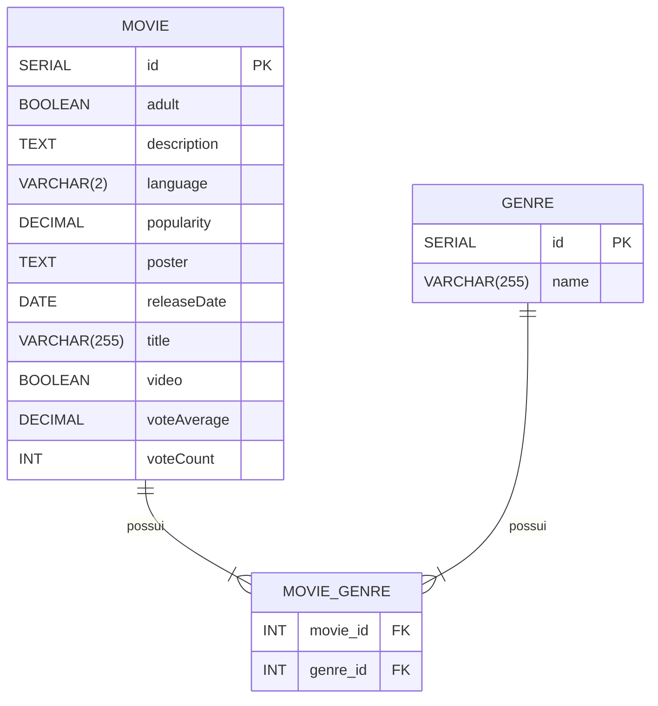

<div align="center">
  
  
  
  <a href="https://github.com/EdnaldoLuiz/movie-analytics/blob/main/LICENSE">
    
  </a>
</div>

## Índice

- [🖥️ Configurações do Servidor](#configurações-do-servidor)
- [🌐 API Rest](#api-rest)
- [♟️ Padrão de Projeto Strategy](#padrão-de-projeto-strategy)
- [🔗 Modelo Relacional](#modelo-relacional)
- [📚 Principais Dependências](#principais-bibliotecas)
- [🐳 Imagem Docker](#docker-image)
- [🛠️ Tech Stack Utilizada](#tech-stack)

<h2 id="configurações-do-servidor">Configurações do Servidor 🖥️</h2>

<table>
  <thead>
    <tr>
      <th>Servidor</th>
      <th>Descrição</th>
      <th>Endereço</th>
    </tr>
  </thead>
  <tbody>
    <tr>
      <td><strong>Servidor Local</strong></td>
      <td>Este é o servidor que você normalmente usaria durante o desenvolvimento. Ele é executado na sua máquina local e permite que você teste suas alterações rapidamente sem ter que implantá-las em um servidor remoto.</td>
      <td><code>http://localhost:8080</code></td>
    </tr>
    <tr>
      <td><strong>Servidor Docker</strong></td>
      <td>Este servidor é destinado para ambientes conteinerizados e é particularmente útil se você está usando Docker para desenvolvimento ou implantação.</td>
      <td><code>http://localhost:8081</code></td>
    </tr>
    <tr>
      <td><strong>Servidor de Produção</strong></td>
      <td>Este é o servidor onde sua aplicação é executada no ambiente de produção. Ele é configurado para lidar com tráfego real e é otimizado para desempenho e confiabilidade.</td>
      <td><code>http://localhost:8082</code></td>
    </tr>
  </tbody>
</table>

<h2 id="api-rest">API Rest 🌐</h2>

### TMDB Controller

<table align=center>
    <thead>
        <tr>
            <th>Endpoint</th>
            <th>Método</th>
            <th>Response</th>
            <th>Descrição</th>
        </tr>
    </thead>
    <tbody align=center>
        <tr>
            <td>/api/v1/tmdb/fetch</td>
            <td>GET</td>
            <td>Void</td>
            <td>Salvar filmes da API do TMDB no banco de dados local</td>
        </tr>
        <tr>
            <td>/api/v1/tmdb/delete</td>
            <td>DELETE</td>
            <td>Void</td>
            <td>Deletar todos os filmes de gêneros específicos</td>
        </tr>
    </tbody>
</table>

### Genres Controller

<table align=center>
    <thead>
        <tr>
            <th>Endpoint</th>
            <th>Método</th>
            <th>Response</th>
            <th>Descrição</th>
        </tr>
    </thead>
    <tbody align=center>
        <tr>
            <td>/api/v1/genres/count</td>
            <td>GET</td>
            <td>GenreProjection</td>
            <td>Contar a Quantidade de Filmes por Gênero</td>
        </tr>
        <tr>
            <td>/api/v1/genres/total</td>
            <td>GET</td>
            <td>Map&lt;String, Long&gt;</td>
            <td>Contar a Quantidade Total de Gêneros</td>
        </tr>
        <tr>
            <td>/api/v1/genres/vote-average</td>
            <td>GET</td>
            <td>Map&lt;String, Double&gt;</td>
            <td>Calcular a média de votos por gênero</td>
        </tr>
        <tr>
            <td>/api/v1/genres/popular-genres</td>
            <td>GET</td>
            <td>List&lt;GenreProjection&gt;</td>
            <td>Obter os gêneros mais populares</td>
        </tr>
        <tr>
            <td>/api/v1/genres/popular-movies</td>
            <td>GET</td>
            <td>List&lt;PopularMoviesByGenreProjection&gt;</td>
            <td>Obter os filmes mais populares por gênero</td>
        </tr>
    </tbody>
</table>

### Movies Controller

<table align=center>
    <thead>
        <tr>
            <th>Endpoint</th>
            <th>Método</th>
            <th>Response</th>
            <th>Descrição</th>
        </tr>
    </thead>
    <tbody align=center>
        <tr>
            <td>/api/v1/movies/all</td>
            <td>GET</td>
            <td>Page&lt;MovieResponseDTO&gt;</td>
            <td>Buscar todos os Filmes com Paginação</td>
        </tr>
        <tr>
            <td>/api/v1/movies/top10</td>
            <td>GET</td>
            <td>Page&lt;MovieResponseDTO&gt;</td>
            <td>Buscar uma Página com o Top 10 de Filmes</td>
        </tr>
        <tr>
            <td>/api/v1/movies/top5</td>
            <td>GET</td>
            <td>Page&lt;MovieResponseDTO&gt;</td>
            <td>Buscar uma Página com o Top 5 Filmes por Ano</td>
        </tr>
        <tr>
            <td>/api/v1/movies/year</td>
            <td>GET</td>
            <td>Map&lt;String, Long&gt;</td>
            <td>Buscar quantidade de Filmes lançados por Ano</td>
        </tr>
        <tr>
            <td>/api/v1/movies/search</td>
            <td>GET</td>
            <td>Page&lt;Movie&gt;</td>
            <td>Buscar todos os Filmes com Paginação</td>
        </tr>
    </tbody>
</table>

### File Export Controller

<table align=center>
    <thead>
        <tr>
            <th>Endpoint</th>
            <th>Método</th>
            <th>Response</th>
            <th>Descrição</th>
        </tr>
    </thead>
    <tbody align=center>
        <tr>
            <td>/api/v1/file-export/export</td>
            <td>GET</td>
            <td>Resource</td>
            <td>Exportar dados de filmes para um arquivo</td>
        </tr>
    </tbody>
</table>

<h2 id="padrão-de-projeto-strategy">Strategy Pattern ♟️</h2>

### Padrão de Projeto Strategy

No projeto utilizamos o padrão de projeto Strategy para lidar com a exportação de dados de filmes para diferentes formatos de arquivo, especificamente CSV e Excel. permitindo que a logica de exportação seja selecionado em tempo de execução.

### Estrutura

A estrutura do padrão Strategy em nosso projeto é composta por uma interface ExportStrategy e duas classes concretas CSVExportStrategy e ExcelExportStrategy que implementam essa interface. A interface define um método export que recebe um nome de arquivo e uma lista de filmes para exportar.

<div align=center>
        
</div>

As classes concretas implementam o método export de maneira específica para cada formato de arquivo. CSVExportStrategy escreve os dados em um arquivo CSV usando a biblioteca CSVWriter, enquanto ExcelExportStrategy cria uma planilha Excel usando a biblioteca XSSFWorkbook.

No serviço FileExportService, temos um mapa strategies que mapeia um FileExportType (um enum que representa o tipo de arquivo) para uma instância de ExportStrategy. Isso nos permite selecionar a estratégia de exportação correta com base no tipo de arquivo desejado em tempo de execução.

### Por que o Padrão Strategy?

Ele oferece uma maneira flexível de selecionar um algoritmo em tempo de execução. Isso nos permite adicionar facilmente suporte para novos formatos de arquivo no futuro, simplesmente adicionando novas classes que implementam a interface ExportStrategy e adicionando-as ao Map no serviço, promovendo a separação de preocupações e tornando o código mais testável, pois cada estratégia de exportação pode ser testada isoladamente.

<h2 id="modelo-relacional">Modelo Relacional</h2>

No projeto, temos um relacionamento muitos-para-muitos entre Movie (Filme) e Genre (Gênero). Isso significa que um filme pode pertencer a vários gêneros e um gênero pode ser associado a vários filmes.

### Estrutura
A estrutura desse relacionamento em nosso projeto é representada por três tabelas no banco de dados: movies, genres e movie_genres. A tabela movie_genres é uma tabela de junção que resolve o relacionamento muitos-para-muitos entre movies e genres.



### Por que esse modelo?
Esse modelo de dados nos permite representar de forma eficiente a relação entre filmes e gêneros. Ele também facilita consultas complexas, como encontrar todos os filmes de um determinado gênero ou encontrar todos os gêneros de um determinado filme.

Além disso, a tabela de junção movie_genres permite que mantenhamos a integridade dos dados, garantindo que cada combinação de filme e gênero seja única.

<h2 id="principais-bibliotecas">Principais Dependências 📚</h2>

### Spring Boot 🌱

Bibliotecas Spring Boot base utilizadas no projeto:

```xml
<dependency>
    <groupId>org.springframework.boot</groupId>
    <artifactId>spring-boot-starter-validation</artifactId>
</dependency>
<dependency>
    <groupId>org.springframework.boot</groupId>
    <artifactId>spring-boot-starter-web</artifactId>
</dependency>
<dependency>
    <groupId>org.springframework.boot</groupId>
    <artifactId>spring-boot-starter-data-jpa</artifactId>
</dependency>
```

### Lombok 🌶️

Biblioteca utilizada para facilitar o desenvolvimento, removendo código boilerplate:

```xml
<dependency>
    <groupId>org.projectlombok</groupId>
    <artifactId>lombok</artifactId>
    <optional>true</optional>
</dependency>
```

### Banco de Dados 🛢️

Bibliotecas utilizadas para migração e estruturação do banco de dados SQL com Flyway e Postgres:

```xml
<dependency>
    <groupId>org.flywaydb</groupId>
    <artifactId>flyway-core</artifactId>
</dependency>
<dependency>
    <groupId>org.flywaydb</groupId>
    <artifactId>flyway-database-postgresql</artifactId>
    <version>10.10.0</version>
    <scope>runtime</scope>
</dependency>
<dependency>
    <groupId>org.postgresql</groupId>
    <artifactId>postgresql</artifactId>
    <scope>runtime</scope>
</dependency>
```

### Cache com Redis 🟥🔄

Biblioteca utilizada para acesso o armazenamento em cache com Redis:

```xml
<dependency>
    <groupId>org.springframework.boot</groupId>
    <artifactId>spring-boot-starter-data-redis</artifactId>
</dependency>
```

### Exportar Arquivos 📁

Bibliotecas utilizadas para a exportação de arquivos CSV e Excel:

```xml
<!-- CSV -->
<dependency>
    <groupId>com.opencsv</groupId>
    <artifactId>opencsv</artifactId>
    <version>5.6</version>
</dependency>
<!-- Excel -->
<dependency>
    <groupId>org.apache.poi</groupId>
    <artifactId>poi-ooxml</artifactId>
    <version>5.2.5</version>
</dependency>
```

### Docker Compose 🐳

Biblioteca utilizada para facilitar a inicialização do docker-compose ao iniciar um projeto Spring:

```xml
<dependency>
    <groupId>org.springframework.boot</groupId>
    <artifactId>spring-boot-docker-compose</artifactId>
    <scope>runtime</scope>
</dependency>
```

### Documentação 📖

Bibliotecas utilizadas para documentação com Springdoc OpenAPI e visualização com Swagger:

```xml
<dependency>
    <groupId>org.springdoc</groupId>
    <artifactId>springdoc-openapi-starter-webmvc-ui</artifactId>
    <version>2.3.0</version>
</dependency>
<dependency>
    <groupId>org.springdoc</groupId>
    <artifactId>springdoc-openapi-data-rest</artifactId>
    <version>1.5.12</version>
</dependency>
```

<h2 id="docker-image">Imagem Docker 🐳</h2>

Você pode encontrar a imagem Docker para este projeto no DockerHub. A imagem contém toda a aplicação configurada para ser executada em ambientes Docker.

<b>1. Pull da imagem</b>
```bash
docker pull ednaldoluiz/movie-analytics-api:latest
```

<b>2. Executar o container</b>
```bash
docker run -d -p 8080:8080 ednaldoluiz/movie-analytics-api:latest
```

Detalhes da Imagem
<table align=center>
    <thead>
        <tr>
            <th>URL do Repositório</th>
            <th>Repositório DockerHub</th>
            <th>Tags Disponíveis</th>
            <th>Plataforma</th>
        </tr>
    </thead>
    <tbody align=center>
        <tr>
            <td>https://hub.docker.com/repository/docker/ednaldoluiz/movie-analytics-api/general</td>
            <td>ednaldoluiz/movie-analytics-api</td>
            <td>latest, v1.0.0</td>
            <td>Linux/AMD64</td>
        </tr>
    </tbody>
</table>

Variáveis de Ambiente

Você pode configurar o container utilizando variáveis de ambiente. Exemplo de Uso com Variáveis de Ambiente

```bash
docker run -d -p 8080:8080 \
  -e SPRING_DATASOURCE_URL=jdbc:postgresql://db:5432/movie_db \
  -e SPRING_DATASOURCE_USERNAME=postgres \
  -e SPRING_DATASOURCE_PASSWORD=example \
  -e REDIS_HOST=redis \
  -e REDIS_PORT=6379 \
  ednaldoluiz/movie-analytics-api:latest
```

<h2 id="tech-stack">Tech Stack Utilizada 🛠️</h2>

<table align="center" width=1000px>
    <thead>
        <tr>
            <th></th>
            <th></th>
            <th></th>
            <th></th>
            <th></th>
            <th></th>
            <th></th>
        </tr>
    </thead>
    <tbody align="center">
        <tr>
            <td>Postgres 🔖 16.2</td>
            <td>Hibernate 🔖 6.3</td>
            <td>Spring Boot 🔖 3.2.3</td>
            <td>Java 🔖 17.0.6</td>
            <td>Redis 🔖 7.2.4</td>
            <td>IntelliJ 🔖 2023.3.2</td>
            <td>Docker 🔖 4.29.0</td>
        </tr>
    </tbody>
</table>
